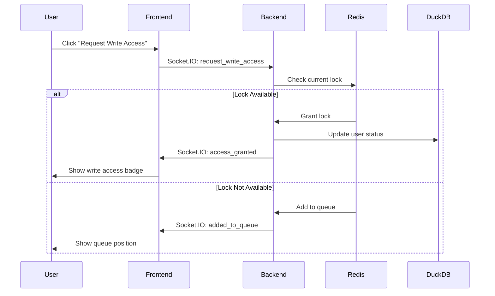
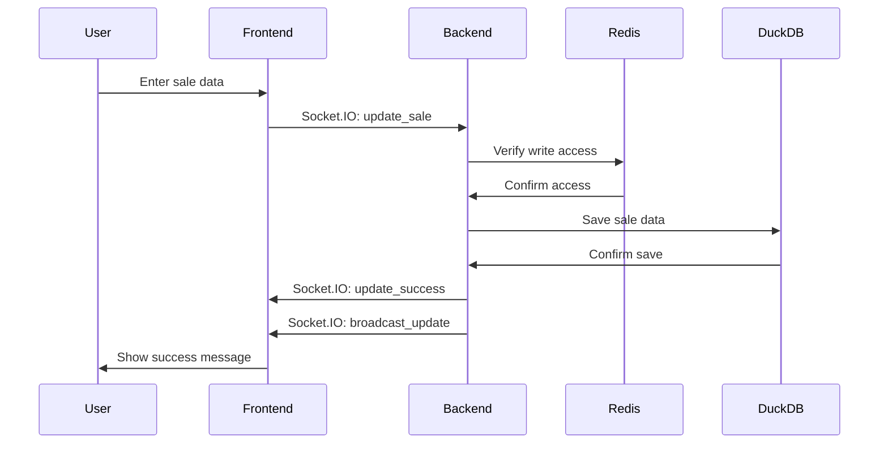

# Spreadsheet Application Design Document

## System Architecture

### Components
1. Frontend (HTML, CSS, JavaScript)
   - User interface
   - Real-time updates via Socket.IO
   - Write access management UI
   - Visual status indicators
   - Bootstrap 5 for responsive design

2. Backend (Python, Flask)
   - REST API endpoints
   - Socket.IO server
   - Database operations
   - Authentication
   - Write access queue management
   - Environment configuration

3. Database (DuckDB)
   - User data
   - Sales records
   - Categories
   - Schema management

4. Session Management (Redis)
   - Write access queue
   - User sessions
   - Lock management
   - Real-time status updates

### Sequence Diagrams

#### Write Access Request Flow


#### Sales Data Update Flow


### Write Access System

#### Queue Management
- Redis-based queue system
- First-in-first-out (FIFO) queue
- Automatic timeout after 10 seconds of inactivity
- Visual status indicator in UI
- Queue position updates in real-time

#### Access Control
1. Request Process:
   - User clicks "Request Write Access"
   - System checks current lock status
   - If available, grants access immediately
   - If not available, adds to queue
   - Updates UI with queue position

2. Release Process:
   - Automatic after 10 seconds of inactivity
   - Manual release on logout
   - Next user in queue receives access
   - Broadcasts update to all clients
   - Updates UI for all connected users

3. UI Indicators:
   - Green badge shows when user has write access
   - Disabled buttons when no write access
   - Success/error messages for access changes
   - Real-time queue position updates

## Database Schema

### Tables
1. Users
   ```sql
   CREATE TABLE users (
       id BIGINT PRIMARY KEY,
       username VARCHAR NOT NULL UNIQUE,
       password_hash VARCHAR NOT NULL,
       email VARCHAR NOT NULL UNIQUE,
       name VARCHAR NOT NULL,
       created_at TIMESTAMP DEFAULT CURRENT_TIMESTAMP
   );
   ```

2. Sales
   ```sql
   CREATE TABLE sales (
       id BIGINT PRIMARY KEY,
       date DATE NOT NULL,
       invoice_number VARCHAR NOT NULL UNIQUE,
       customer_name VARCHAR NOT NULL,
       location VARCHAR NOT NULL,
       product_name VARCHAR NOT NULL,
       category VARCHAR NOT NULL,
       volume_sold DECIMAL(10,2) NOT NULL,
       unit VARCHAR NOT NULL,
       created_by VARCHAR NOT NULL,
       created_at TIMESTAMP DEFAULT CURRENT_TIMESTAMP,
       updated_at TIMESTAMP DEFAULT CURRENT_TIMESTAMP
   );
   ```

3. Categories
   ```sql
   CREATE TABLE categories (
       id BIGINT PRIMARY KEY,
       name VARCHAR NOT NULL UNIQUE,
       description VARCHAR,
       created_at TIMESTAMP DEFAULT CURRENT_TIMESTAMP
   );
   ```

## Security Measures

1. Authentication
   - Password hashing
   - Session management
   - CSRF protection
   - Environment-based configuration

2. Data Access
   - Write access control
   - Input validation
   - SQL injection prevention
   - Redis-based locking

3. Real-time Features
   - Socket.IO authentication
   - Message validation
   - Error handling
   - Connection monitoring

## Error Handling

1. Frontend
   - User-friendly error messages
   - Automatic retry for failed operations
   - Connection status monitoring
   - Write access status updates

2. Backend
   - Input validation
   - Database error handling
   - Socket.IO error handling
   - Redis connection management

## Development Guidelines

### Code Quality
- Ruff for linting and formatting
- Pre-commit hooks for code quality
- Consistent code style
- Type hints and documentation

### Testing
- Unit tests for core functionality
- Integration tests for API endpoints
- Socket.IO event testing
- Database operation testing

### Deployment
- Environment-based configuration
- Docker containerization
- Kubernetes orchestration
- CI/CD pipeline integration

## Future Enhancements

1. Features
   - Data export
   - Advanced filtering
   - User roles
   - Data backup
   - Visualization

2. Performance
   - Caching
   - Pagination
   - Optimized queries

3. Security
   - Rate limiting
   - Audit logging
   - Enhanced validation

## Project Structure
```
spreadsheetApplication/
├── backend/
│   ├── routes/
│   │   └── spreadsheet.py
│   └── app.py
├── frontend/
│   └── spreadsheet.html
├── database/
│   └── sales.db
├── kubernetes/
│   ├── deployment.yaml
│   ├── service.yaml
│   └── configmap.yaml
├── certs/
│   ├── server.crt
│   └── server.key
├── README.md
├── DESIGN.md
├── run.py
└── setup.py
``` 
