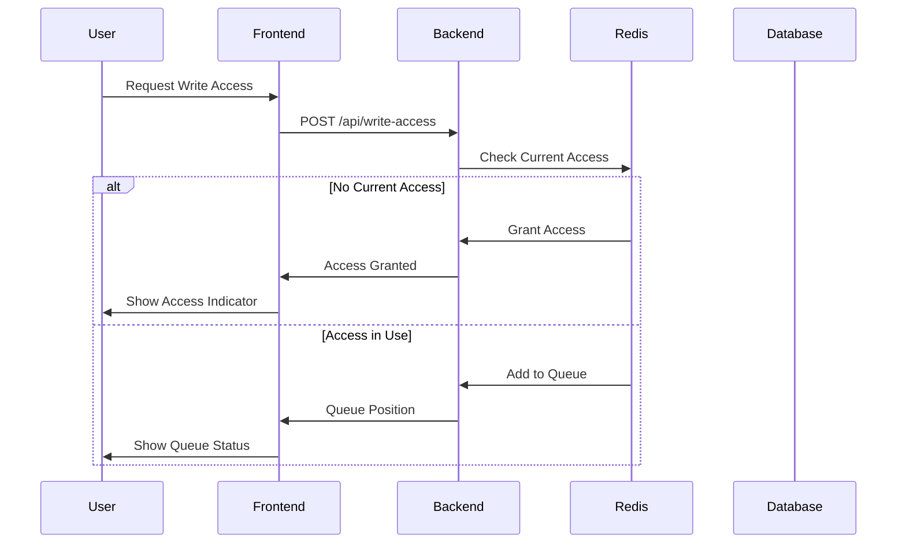
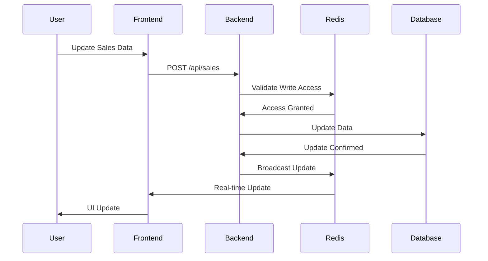

# Spreadsheet Application Design Document

## System Architecture

### Components

1. **Frontend Layer**
   - User Interface (HTML, CSS, JavaScript)
   - Real-time Communication (Socket.IO Client)
   - State Management
   - Error Handling

2. **Backend Layer**
   - Web Server (Flask)
   - API Endpoints
   - Business Logic
   - Data Validation

3. **Data Layer**
   - Database (DuckDB)
   - Cache (Redis)
   - Data Models
   - Query Optimization

4. **Infrastructure Layer**
   - Containerization (Docker)
   - Orchestration (Kubernetes)
   - Monitoring
   - Logging

### Communication Flow

1. **Client-Server Communication**
   - RESTful API endpoints
   - WebSocket connections
   - HTTP/HTTPS protocols
   - Authentication tokens

2. **Inter-Service Communication**
   - Redis pub/sub for real-time updates
   - Database transactions
   - Service discovery
   - Load balancing

## Sequence Diagrams

### Write Access Request Flow



### Sales Data Update Flow



## Write Access System

### Queue Management

1. **Queue Structure**
   - First-In-First-Out (FIFO) implementation
   - Priority levels (if implemented)
   - Timeout handling
   - Queue position tracking

2. **Access Control**
   - Session-based access
   - Automatic release after inactivity
   - Manual release option
   - Access transfer between users

3. **State Management**
   - Redis-based state storage
   - Atomic operations
   - Conflict resolution
   - State synchronization

## Database Schema

### Tables

1. **Users**
   ```sql
   CREATE TABLE users (
       id INTEGER PRIMARY KEY,
       username TEXT UNIQUE NOT NULL,
       password_hash TEXT NOT NULL,
       created_at TIMESTAMP DEFAULT CURRENT_TIMESTAMP
   );
   ```

2. **Sales**
   ```sql
   CREATE TABLE sales (
       id INTEGER PRIMARY KEY,
       category TEXT NOT NULL,
       amount DECIMAL(10,2) NOT NULL,
       date DATE NOT NULL,
       user_id INTEGER REFERENCES users(id),
       created_at TIMESTAMP DEFAULT CURRENT_TIMESTAMP
   );
   ```

3. **Categories**
   ```sql
   CREATE TABLE categories (
       id INTEGER PRIMARY KEY,
       name TEXT UNIQUE NOT NULL,
       description TEXT,
       created_at TIMESTAMP DEFAULT CURRENT_TIMESTAMP
   );
   ```

### Indexes
- User authentication
- Sales data retrieval
- Category lookups
- Date-based queries

## Security Measures

1. **Authentication**
   - Password hashing (bcrypt)
   - Session management
   - Token-based authentication
   - Rate limiting

2. **Data Protection**
   - Input validation
   - SQL injection prevention
   - XSS protection
   - CSRF tokens

3. **Access Control**
   - Role-based access
   - Write access queue
   - Resource limits
   - Audit logging

## Error Handling

1. **Client-Side**
   - User-friendly error messages
   - Retry mechanisms
   - State recovery
   - Network error handling

2. **Server-Side**
   - Exception handling
   - Logging
   - Error reporting
   - Graceful degradation

3. **Database**
   - Transaction management
   - Connection pooling
   - Query optimization
   - Backup strategies

## Development Guidelines

1. **Code Style**
   - PEP 8 compliance
   - Type hints
   - Documentation
   - Testing requirements

2. **Version Control**
   - Branch naming
   - Commit messages
   - Pull requests
   - Code review process

3. **Testing**
   - Unit tests
   - Integration tests
   - Performance tests
   - Security tests

## Future Enhancements

1. **Features**
   - Advanced analytics
   - Export capabilities
   - User roles
   - API versioning

2. **Performance**
   - Caching strategies
   - Database optimization
   - Load balancing
   - CDN integration

3. **Scalability**
   - Microservices architecture
   - Horizontal scaling
   - Database sharding
   - Message queues

## Project Structure

```
spreadsheetApplication/
├── backend/
│   ├── config/              # Configuration management
│   ├── database/           # Database operations
│   ├── routes/             # API endpoints
│   ├── utils/              # Utility functions
│   └── app.py             # Main application
├── frontend/              # User interface
├── kubernetes/           # Deployment configurations
├── tests/               # Test suite
├── database/           # Local database storage
├── certs/             # SSL certificates
├── .github/          # CI/CD workflows
└── docs/            # Documentation
```

## Deployment Architecture

1. **Development**
   - Local environment setup
   - Development server
   - Hot reloading
   - Debug tools

2. **Staging**
   - Test environment
   - Performance testing
   - Security scanning
   - User acceptance testing

3. **Production**
   - Kubernetes cluster
   - Load balancing
   - Monitoring
   - Backup systems

## Monitoring and Logging

1. **Metrics**
   - Application performance
   - Database queries
   - Cache hits/misses
   - User activity

2. **Logging**
   - Application logs
   - Error tracking
   - Audit logs
   - Security events

3. **Alerting**
   - Error notifications
   - Performance alerts
   - Security alerts
   - Capacity warnings 
